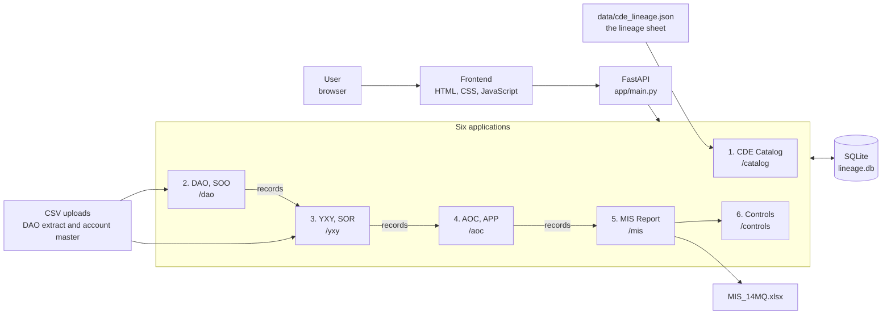
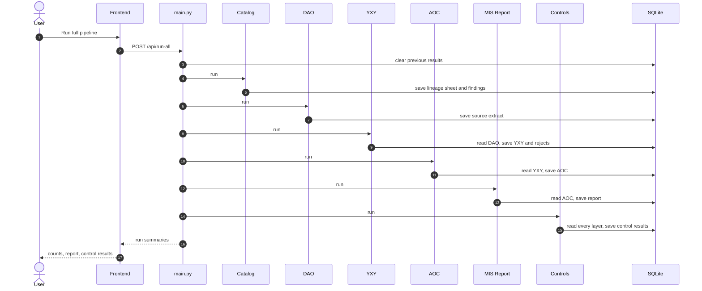
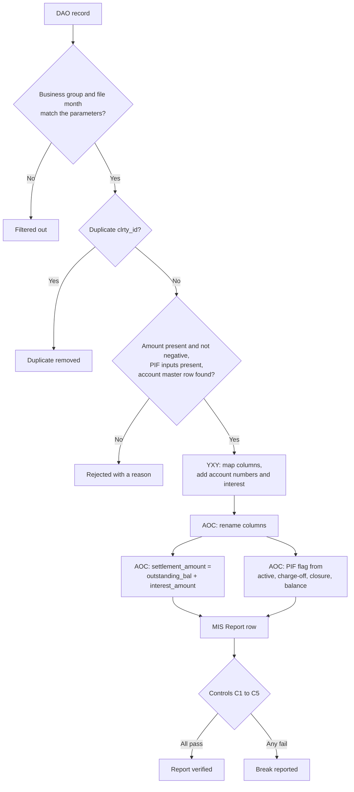
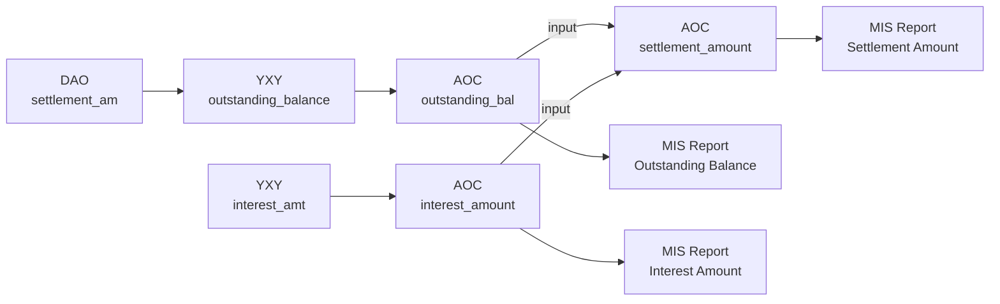
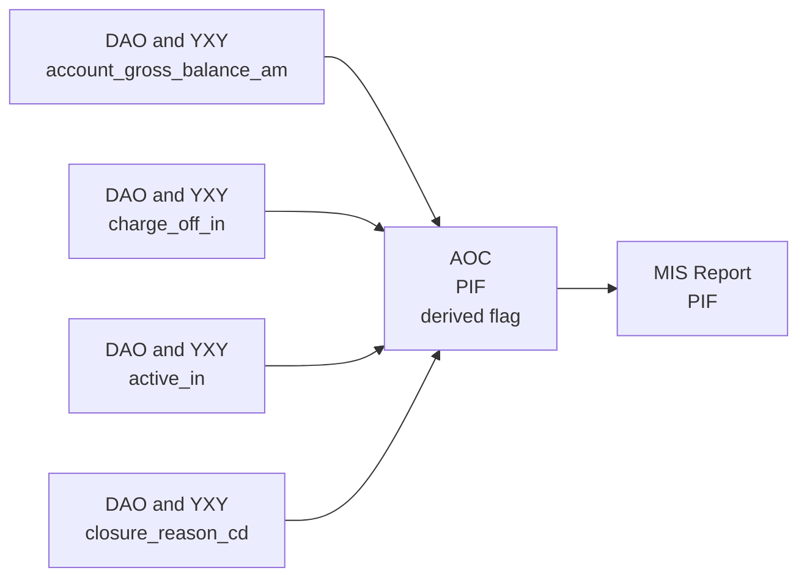

# Data Lineage Platform: Architecture and Lineage

GitHub draws the Mermaid diagrams in this file.

The platform is one FastAPI application hosting six applications. It follows the lineage sheet:
**DAO (SOO) → YXY (SOR) → AOC (APP) → MIS Report**. These match the three zones of the End-to-End Lineage diagram:
System of Origination, System of Record and Authorized Provisioning Point, and Data Consumers.

## 1. Platform overview

## 2. What happens on Run full pipeline

## 3. What happens to a record

## 4. Lineage of Settlement Amount

Field names are the physical names from the lineage sheet.

## 5. Lineage of PIF (Paid in Full)

## 6. Field mapping across hops

| CDE | DAO (SOO) | YXY (SOR) | AOC (APP) | MIS Report | What happens |
|---|---|---|---|---|---|
| Treatment | `workout_completed_cd` | `treatment_cd` | `Treatment` | `Treatment` | Passed through, renamed |
| Outstanding Balance | `settlement_am` | `outstanding_balance` | `outstanding_bal` | `Outstanding Balance` | Passed through, renamed |
| Interest Amount | not documented | `interest_amt` | `interest_amount` | `Interest Amount` | Created at YXY |
| Settlement Amount | not documented | not documented | `settlement_amount` | `Settlement Amount` | Derived at AOC |
| Account Number | not documented | `account_nm` | `account_number` | `Account Number` | Created at YXY |
| Child_AccountNumber | not documented | `chld_account_nm` | `child_account_number` | `Child_AccountNumber` | Created at YXY |
| Ledger_AccountNumber | not documented | `ldgr_account_nm` | `ledger_account_number` | `Ledger_AccountNumber` | Created at YXY |
| PIF | sub-fields | sub-fields | `PIF` | `PIF` | Derived at AOC |

## 7. Controls

| Control | Check | Result type |
|---|---|---|
| C1 | DAO rows are fully accounted for at YXY, and YXY, AOC and MIS row counts agree | Fail on any break |
| C2 | Pass-through fields in the report equal the source values | Fail on any break |
| C3 | Settlement Amount recomputed from DAO and YXY equals the report | Fail on any break |
| C4 | PIF recomputed from the source sub-fields equals the report | Fail on any break |
| C5 | Every report column is documented at the MIS hop in the lineage sheet | Warning |

## 8. API surface

| Path | Purpose |
|---|---|
| `POST /api/run-all` | Reset and run all six apps. Optional: `inject_fault`, `file_month`, `business_group` |
| `POST /api/reset` | Clear pipeline results |
| `POST /api/reset-sources` | Go back to the built-in sample data and default parameters |
| `GET /api/status` | Last run summary per app, parameters and data sources |
| `GET /api/trace/{clrty_id}` | One record at every hop, with physical field names |
| `POST /{app}/run`, `GET /{app}/output` | Run or read each app: catalog, dao, yxy, aoc, mis, controls |
| `GET /dao/sample.csv`, `POST /dao/upload` | Download the sample DAO file, upload your own |
| `GET /yxy/account-master.csv`, `POST /yxy/upload-account-master` | Same for the account master |
| `GET /mis/download` | MIS_14MQ.xlsx with a Controls sheet |
| `GET /catalog/mermaid/{cde}` | Mermaid lineage for one CDE |
